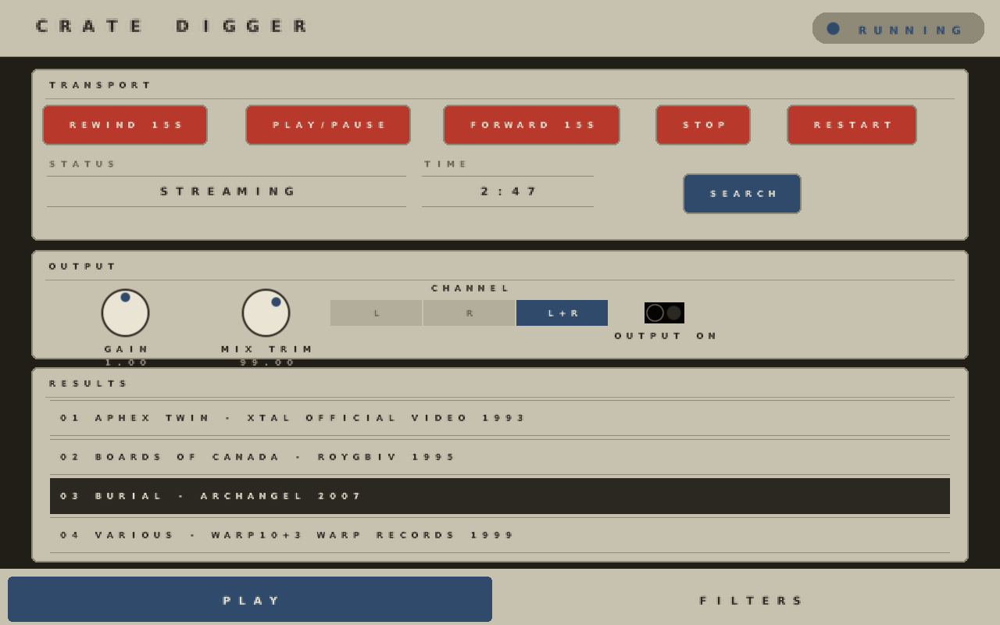
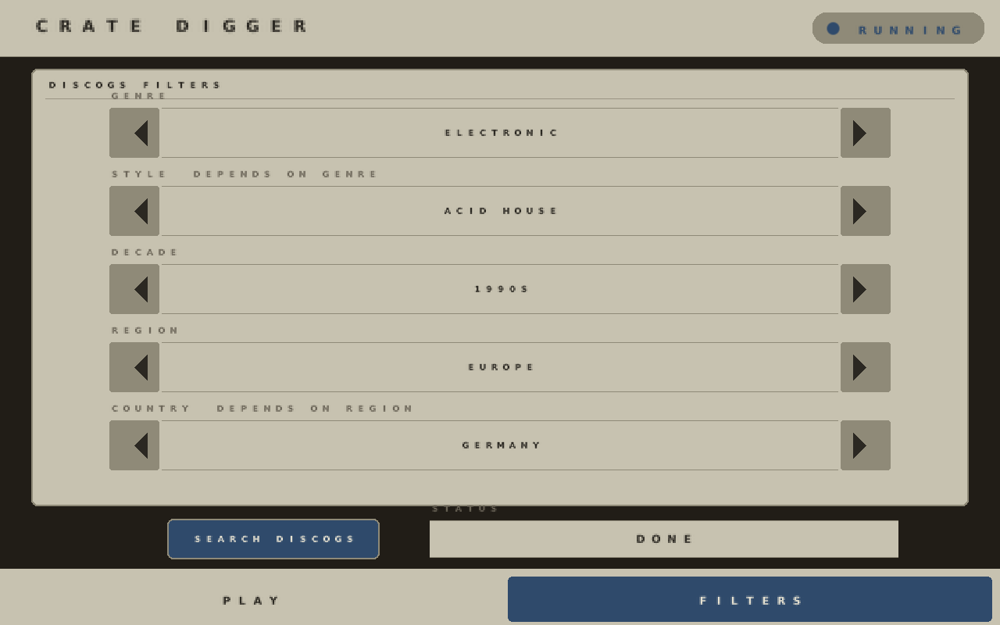

# force-cratedigger

A [MockbaMod](http://mockbatheb.org/) AddOn for the Akai Force: random
music discovery via Discogs "crate dig" — filter by genre, style, decade,
region, and country, browse hits, and play them as a real audio-generator
voice. Browser web GUI and an on-device touchscreen ("shadow GUI") page,
both themed after a vintage Akai MPC60.

This is a **port and refocus** of Charles Vestal's
**[schwung-webstream](https://github.com/charlesvestal/schwung-webstream)**
(MIT licensed), originally built for Ableton Move as a multi-provider
search/streaming module (YouTube, SoundCloud, archive.org, Freesound, and
Discogs crate-dig). The engine underneath is still that full module,
untouched — this addon's own UI just exposes only the Crate Dig feature.
All credit for the DSP core, the Discogs search/resolve/streaming
pipeline, and the whole yt-dlp/ffmpeg-backed design goes to that project —
see [Credit & what's actually new here](#credit--whats-actually-new-here).

## Screenshots

Shadow GUI (Force Shadow companion page), rendered offline from the real
`shadow_page.conf` via `force-shadow/tools/render_conf_preview.c` — see
[How it works](#how-it-works-for-anyone-extending-this) for why that
tool, not a live device, is the source of truth for these:

| PLAY | FILTERS |
|---|---|
|  |  |

The web GUI (`addon/web/index.html`) has no offline screenshot here —
this repo was built in an environment with no headless browser available
to capture one. It's plain, dependency-free HTML/CSS/JS; open it in any
browser to see it, or read the file directly.

## What you get

- **Engine** (`cratedigger_host`): a native armhf process that links the
  ported DSP core directly, renders decoded audio in real time, and mixes
  it into the Force's own audio output via the
  [force-audioin](https://github.com/sd88me/force-audioin) shared-memory
  tap (the same mechanism [force-maze](../force-maze)'s Maze Voice port
  uses). Forces `search_provider` to `cratedig` at startup — the engine's
  other providers are still fully present, just not reachable from this
  addon's own UI (see `main()`'s own comment).
- **Web GUI** (`addon/web/`): cascading Genre → Style and Region → Country
  dropdowns plus a Decade dropdown, a dedicated **Search Discogs** button
  (nothing searches until you press it), a results list, transport
  control (play/pause, ±15s seek, stop, restart), gain, download to WAV,
  and a **Skipback Rec** button (see below).
- **Shadow GUI** (`addon/shadow_page.conf`): a `style=td3` page themed
  after a vintage Akai MPC60, slot 9 — reachable from the on-screen
  **ADD-ONS** launcher (Force Shadow's own slot 7), since all seven
  direct `SHIFT+SCENE-N` hardware combos were already claimed by other
  addons on this device by the time this one was built (edit `page=` in
  `shadow_page.conf` if your own device has a free slot 1-7 and you'd
  rather have a direct combo). Two tabs:
  - **PLAY** — transport, output gain/routing, engine on/off, a
    **Skipback Rec** button, a results list (tap to play), and its own
    **SEARCH** button so a filter set on the FILTERS tab can be re-run
    without switching tabs.
  - **FILTERS** — five steppers (Genre, Style, Decade, Region, Country —
    Style depends on the current Genre, Country on the current Region)
    and a dedicated **SEARCH DISCOGS** button, same "nothing searches
    until you press it" behavior as the web GUI.
- **Skipback Rec**: a red button (both GUIs) that starts/stops
  [force-audioin](https://github.com/sd88me/force-audioin)'s separate
  `skipbackHost` process — continuous rolling-buffer recording of the
  Force's real main mix, so a `SHIFT+RECORD` shortcut can save the last
  N seconds retroactively. This addon doesn't run or own that process;
  the button fires the same nodeServer `/moduler/UPDATE` start/stop
  call the on-device Modules page itself uses (see
  `cratedigger_host.cpp`'s `send_skipback_toggle()`). Requires
  force-audioin's Force Audio Jack feature to actually be installed and
  its own tap armed — this button only starts/stops `skipbackHost`
  itself, same "toggling here doesn't arm the underlying tap" caveat
  ForceAudioJackSkipback's own `NSMODULE.json` states.

  Whenever this addon plays a search result, it writes the track's
  title (and channel) — plus its tempo, *if the data source actually
  has one for that track* — to `/tmp/force_nowplaying.txt`, a generic
  "now playing" convention any addon could use. A patched
  `skipbackHost.c` (force-audioin repo) checks that file before falling
  back to its usual Force-project-name/tempo lookup, so a skipback
  recording taken while a track is playing is named after the track
  instead of the current Force project — and, if the data source
  actually has a tempo for that track, its own tempo instead of the
  Force project's tempo. Discogs — crate-dig's only real data source
  right now — has no BPM field on a release at all (confirmed directly
  in `src/bin/yt_dlp_daemon.py`'s `cratedig_search()`, which sends an
  empty tempo field unconditionally), so in practice this only replaces
  the *name* today, never the *tempo*. Deliberately **not** falling back
  to the Force project's own tempo in that case — the project tempo is
  the sequencer's, unrelated to whatever external track is actually
  playing, and printing it in the filename would misrepresent the
  recording as being at that tempo — so a crate-dig-triggered skipback
  recording with no real track tempo just has no bpm segment in its
  filename at all. The lookup is still wired end-to-end and reads the
  real field rather than assuming it's empty, so a track tempo starts
  appearing automatically the day one's added for crate-dig results — no
  change needed on this side then.

## How it works (for anyone extending this)

Same "port the host, not the DSP" pattern as this device's other Schwung
ports (force-maze, force-acid) — see
`~/.claude/skills/mockbamod-module-creator/references/porting-schwung-modules.md`
if you have that skill installed, or just read `src/cratedigger_host.cpp`'s
own header comment. In short:

- `src/dsp/yt_stream_plugin.c` is vendored **near-verbatim** from
  upstream — only two Move-specific absolute paths changed (see the file's
  own top-of-file comment). Every provider, the 60-second ring buffer, the
  yt-dlp daemon protocol, and the entire `set_param`/`get_param` control
  surface are unmodified — this addon's "crate-dig only" framing is a UI
  choice (`main()` forces `search_provider`, and neither GUI exposes a
  provider picker), not a DSP-level restriction.
- `src/cratedigger_host.cpp` is new: it links that DSP core directly (no
  `dlopen`), drives it from a wall-clock timer thread (the DSP core has no
  fixed block-size assumption — see that file's comments), and exposes a
  Unix control socket (`SET`/`GET`/`DESCRIBE`) that both the web GUI and
  the shadow GUI talk to. Unlike Maze Voice's host, this one has **no
  MIDI at all** — this module isn't note-driven (`module.json` declares
  `midi_in`/`midi_out` both false), so there's no RtMidi/ALSA dependency
  to link.
- Beyond `mix.*` (host-level output routing, same convention as every
  other addon in this family), the shim adds: `search_results_json`/
  `search_results_shadow_json` (aggregates the core's per-index
  `search_result_*_<n>` keys into one JSON array — the shadow variant
  also runs each field through `shadow_font_safe()`, see below);
  `play_result_index` (composes the core's own `stream_provider`+
  `stream_url` SETs from one result index); and the whole `cratedig_*`
  family (`cratedig_genre_index`/`_style_index`/`_decade_index`/
  `_region_index`/`_country_index` SET, their `_text`/`_idx`/`_count` GET
  triples, and `cratedig_search_go`) that drives the shadow GUI's five
  FILTERS steppers — see `cratedigger_host.cpp`'s control-socket header
  comment for the exact contract, and `send_cratedig_filter_from_shadow_
  state_locked()` for how a SEARCH tap composes all five into the core's
  real `cratedig_filter` key (the thing that actually triggers a Discogs
  search).
- **Font constraint that shaped a real design decision**: Force Shadow's
  baked font (`force-shadow/src/font8x8.h`) is space/`A-Z` (upper-case
  only)/`0-9`/`. - / > % + :` — nothing else. A raw Discogs genre/style
  string (commas, ampersands, lowercase) renders as scattered near-blank
  text otherwise. `shadow_font_safe()` handles this generically
  (uppercase + filter to that exact set); genre/style/decade/region/
  country tables keep the *real* Discogs value and a shadow-safe display
  version deliberately separate (`cd_display_text()`), since the value
  sent to Discogs must stay byte-accurate even when its on-screen label
  is transformed or truncated.

## Theme

`style=td3` (rounded frames, pill buttons, pill engine button — a shape
mode) plus a mostly-achromatic palette inspired by a real Akai MPC60
photo: a charcoal page background, greige boxes/top bar/bottom bar, and
the same dark grey already used for the top-bar title and tab labels for
body text and frame titles. Navy blue is reserved for the handful of
things a player actually interacts with — knob pointers, the engine
on/off pill when running, the active tab, the CHANNEL selector's active
segment, and the Search button specifically (every other button stays
MPC red) — added via two small, additive changes to `force-shadow`'s own
renderer (`theme_knob_dot`, a new theme field independent of `accent` so
the knob dot could go blue without every other accent-colored text
following it; and a per-`button` `color=` override, since force_shadow.c
previously had one global button color for the whole page). The web
GUI's CSS mirrors the same split. Selected list rows still invert to a
plain dark-grey/cream pair, no blue. `style=td3` and the colors are
independent knobs — see `addon/shadow_page.conf`'s own top-of-file
comment. The web GUI (`addon/web/index.html`) uses matching CSS tokens
for visual consistency between the two surfaces.

## Build

Requires Docker with armhf emulation (see
`force-acid/scripts/build.sh`'s own comment for the one-time
`qemu-user-static` setup on a bare dockerd).

```sh
./scripts/build-deps.sh   # fetch yt-dlp + ffmpeg/ffprobe (see Known Limitations re: deno)
./scripts/build.sh        # compile cratedigger_host, assemble dist/ForceCrateDigger/
```

`dist/ForceCrateDigger/` is the full addon folder, ready to deploy.

## Deploy

```sh
./scripts/deploy.sh root@<force-ip>
```

Or by hand: `scp -r dist/ForceCrateDigger root@<force-ip>:<mmPath>/AddOns/ForceCrateDigger`
(get `mmPath` from the device with `cat /dev/shm/.mmPath` over SSH).

## Required per-device edits before enabling

Two files hardcode absolute paths to addon install locations —
`/media/CHANGE_ME/AddOns/ForceCrateDigger` and (for the Skipback Rec
button) `/media/CHANGE_ME/AddOns/ForceAudioJackSkipback/NSMODULE.json` —
because MockbaMod addon paths are genuinely per-device (the SD card's
mount point varies), not something a build step can know in advance.
This is the same situation force-maze/ForceMazeVoice's own
`NSMODULE.json` is in. **Before enabling, edit every occurrence to your
real path** (SSH in, `cat /dev/shm/.mmPath`, then
`<that>/AddOns/ForceCrateDigger` / `<that>/AddOns/ForceAudioJackSkipback`):

- `addon/NSMODULE.json` → the two `ARGUMENTS` entries with `NAME`
  containing "EDIT to your device's real mmPath" (one for this addon's
  own module dir, one for Skipback's NSMODULE.json path)
- `addon/shadow_page.conf` → `engine_nsmodule_path` and the matching
  entries inside `engine_arguments_json` (these two **must stay byte-for-
  byte identical** — Force Shadow's engine on/off button re-sends
  `engine_arguments_json` verbatim to nodeServer, so a stale copy would
  silently corrupt the real `NSMODULE.json` on next toggle)

## Enable

```sh
ssh root@<force-ip> '"<mmPath>/AddOns/ForceCrateDigger/manage.sh" ENABLE'
ssh root@<force-ip> '"<mmPath>/AddOns/ForceCrateDigger/web/manage.sh" ENABLE'
```

Then, separately:

1. Make sure [ForceAudioIn](https://github.com/sd88me/force-audioin) is
   enabled (its own `manage.sh ENABLE`) — it arms the shared audio tap
   this addon writes into. It is a hard dependency for audio output.
2. Start `cratedigger_host` itself from the nodeServer Modules page
   (`http://<force-ip>:8080/moduler`) or via the shadow page's own engine
   button (ADD-ONS launcher → CRATE DIGGER, or your own device's combo if
   you moved it to a free 1-7 slot) — it does **not** auto-launch at boot (see
   `addon/NSMODULE.json`'s `AUTOLAUNCHABLE: false` and the comment in
   `addon/manage.sh`).
3. Browse to `http://<force-ip>:8308/` for the web GUI (always running
   once its own addon is enabled, independent of whether the engine is
   started — every control there just answers "engine not running" until
   `cratedigger_host`'s socket exists).

## Discogs token (optional but recommended)

Crate Dig works without a token (25 requests/min per device via Discogs'
public rate limit). For 60/min, generate a free personal access token at
[discogs.com](https://www.discogs.com/settings/developers) and put it
somewhere the daemon (`src/bin/yt_dlp_daemon.py`) can read:

- Simplest: create `/data/UserData/schwung/config/webstream_providers.json`
  by hand on the device (this default path is a leftover from upstream's
  Move-specific layout, but the daemon looks there regardless of Force
  vs. Move):
  ```json
  { "providers": { "cratedig": { "token": "YOUR_DISCOGS_PERSONAL_TOKEN" } } }
  ```
- Or set a `DISCOGS_TOKEN` env var / point `WEBSTREAM_PROVIDER_CONFIG` at
  a different path — but note `cratedigger_host` is normally launched by
  nodeServer's Modules page, which spawns it directly (no shell, so no
  env var injection via `NSMODULE.json`'s `ARGUMENTS` — see
  `~/.claude/skills/mockbamod-module-creator/references/web-gui.md`'s
  "Modules page" section). For a non-default config path, point
  `PROCESSNAME`/`FILENAME` at a tiny wrapper shell script that exports
  the var and then `exec`s the real binary, instead of the binary
  directly.

## Known limitations (differences from the Move original)

- **No `deno`.** Deno publishes no official armv7/armhf Linux build, only
  x86_64 and aarch64. yt-dlp falls back to its own built-in JS
  interpreter for YouTube signature-cipher extraction — works for most
  videos, but is a weaker fallback than deno for a minority of more
  obfuscated challenges (crate-dig hits resolve via the same YouTube
  pipeline once a match is found).
- Downloads land in `/sdcard/Force Documents/Samples/CrateDigger`, the
  same stable, serial-independent output-dir convention
  [force-audioin](https://github.com/sd88me/force-audioin)'s own Skipback
  feature (`src/skipbackHost.c`'s `DEFAULT_OUTPUT_DIR`) uses — `/sdcard`
  is the Force's own internal-storage mount, not a removable card's
  `/media/<serial>/...` path, and "Force Documents/Samples" is where the
  Force's own sample browser looks. See `mkdir_p()` in
  `src/dsp/yt_stream_plugin.c`, also ported from `skipbackHost.c`.
- **Style and Country are web-GUI-only in one direction.** The shadow
  GUI's FILTERS tab can select all five dimensions, but since it has no
  merged state with the web GUI, tapping SEARCH there sends a filter
  built from *only* its own five stepper selections — see
  `send_cratedig_filter_from_shadow_state_locked()`'s own comment. In
  practice this means picking a genre/decade from the shadow GUI after
  setting a country from the web GUI won't preserve that country; use
  one UI's filter state at a time per search.
- **No Q-Link/MIDI CC control surface.** This port's control surface is
  the web GUI and shadow GUI only, per the original request — no ALSA
  MIDI port is created at all (see [How it works](#how-it-works-for-anyone-extending-this)).
- **The shadow page's layout is offline-render-verified but not tested
  on real hardware.** `force-shadow/tools/render_conf_preview.c` (a
  generic `shadow_page.conf` preview tool, now supporting `style=td3`/
  `theme_*` and every widget kind this page uses) caught and fixed real
  issues before this point — see `docs/previews/*.png` — but nothing
  replaces an actual device pass (touch targets, the engine on/off
  button both directions, a real Discogs search).
- **The render-thread rate-correction constant is inherited, not
  re-measured** for this engine specifically — see
  `src/cratedigger_host.cpp`'s own comment on `RATE_CORRECTION`.

## Credit & what's actually new here

- **Original design, DSP core, provider backends, and daemon**:
  [Charles Vestal](https://github.com/charlesvestal),
  [schwung-webstream](https://github.com/charlesvestal/schwung-webstream),
  MIT licensed — including the genre/style/decade/region/country tables
  this addon's own filter pickers use, ported from that project's
  `src/ui.js`. Third-party notices for yt-dlp/ffmpeg/etc. carried over in
  `UPSTREAM_THIRD_PARTY_NOTICES.md`.
- **New for this port**: the Force host shim (`src/cratedigger_host.cpp`),
  the audio-injection wiring (`src/forceAudioInject.h`, vendored from
  [force-audioin](https://github.com/sd88me/force-audioin)), the crate-
  dig-focused browser web GUI and vintage-MPC theme (`addon/web/`), the
  shadow GUI page and its own take on the same theme
  (`addon/shadow_page.conf`), and all build/deploy/addon-manager scripts.

## Releases

Not tagged yet (current version: `0.2.0` in `addon/module.json`). The
sibling repos this one was built alongside (`force-shadow`, `force-dx7`,
`force-maze`, `force-audioin`) tag releases as `gh release create <tag>
--target <branch> --title … --notes …`, one version scheme per repo (e.g.
`force-shadow` uses `v1.0.0`, `force-maze` tags per-module like
`maze-voice-v1.0.0`) — see that convention (and the rest of the build →
test → deploy → release loop these repos share) in this environment's
`force-device-workflow` skill. This repo would follow the same plain
`vX.Y.Z` scheme once it's had a real device test pass (see
[Known limitations](#known-limitations-differences-from-the-move-original)) —
premature before that.

Third-party, unsupported community addon. Not affiliated with or endorsed
by Akai, InMusic, Ableton, Charles Vestal, or Discogs. Users are
responsible for complying with Discogs' own terms of service and content
rights.
